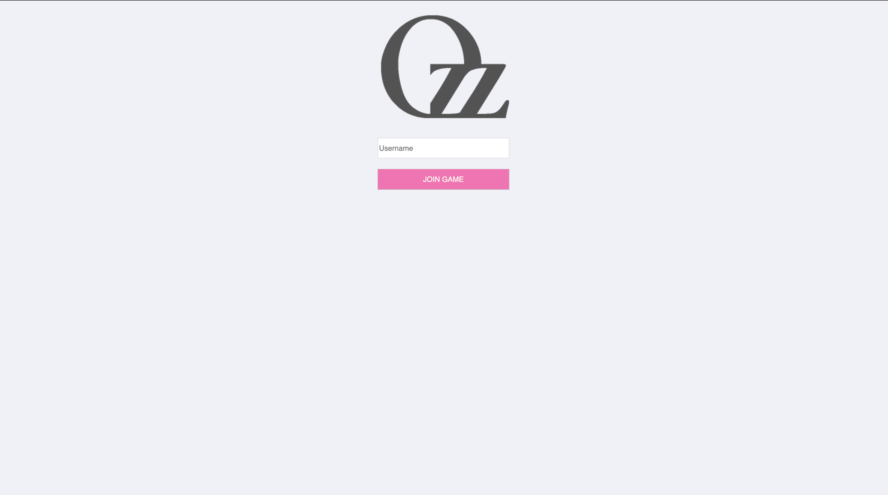
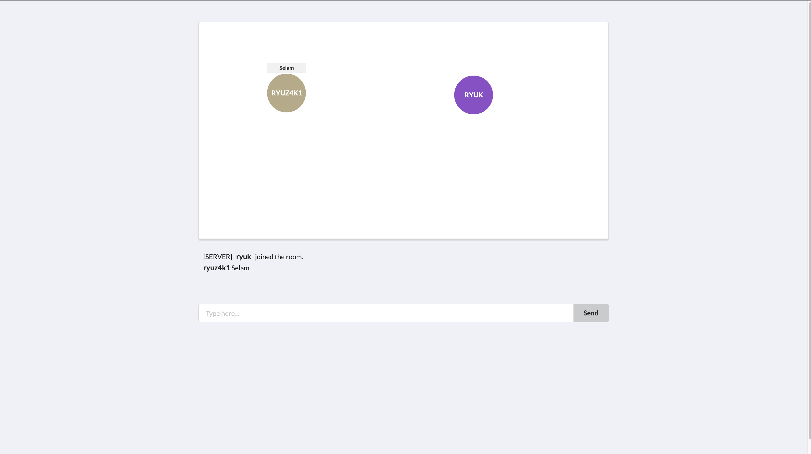

# OzzBall
OzzBall is a real-time multiplayer ball game with browser. In this two-dimensional game, you'll aim at the bird's-eye view.





## Getting Started

### Requirements

* Node.JS
Since this application is based on node js, first you need to download NodeJS [from here](https://nodejs.org/en/download/).

* Essantial packages for npm(Backend side)
    ```
    Socket.io       --> npm install socket.io --save
    Express         --> npm install express --save
    Ejs             --> npm install ejs --save
    Mongoose        --> npm install mongoose --save
    Bower           --> npm install bower --save
    Bower-Global    --> npm install -g bower
    ```

* Essantial packages for bower(UI side)
    ```
    Semantic    --> bower install semantic-ui
    Angular     --> bower install angular
    Jquery      --> bower install jquery
    ```

* You can install a few more package on globally;
  ```
    Nodemon             --> npm install -g nodemon
    Express-Generator   --> npm install express-generator
  ```


## Running locally


### Step 1 - Github
   * Clone this repository.
  
### Step 2 - Install Dependicies
  * npm install

### Step 3 - Run the application
 * npm start


## Author
* [Murat Özer](https://ryuz4k1.github.io/murat-ozer/)


## Smilar Projects
* [SeaChat](https://github.com/ryuz4k1/SeaChat)
* [MovieAPI](https://github.com/ryuz4k1/movie-api)